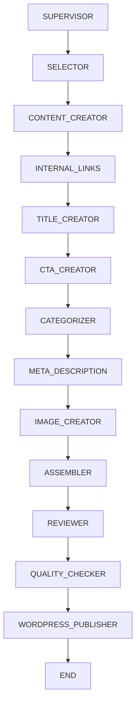

# 📚 CÓMO FUNCIONA EL SISTEMA AGENT BLOGGER

## 🎯 RESUMEN EJECUTIVO

**Agent Blogger** es un sistema automatizado de generación y publicación de artículos para PYMEs que utiliza:
- **LangGraph** para orquestar workflows complejos
- **OpenAI GPT-4** para generación de contenido, categorización, títulos, meta descriptions
- **DALL-E 3** para creación de imágenes personalizadas
- **WordPress REST API** para publicación automática
- **Telegram Bot** para recibir ideas de contenido via audio/texto
- **GitHub Actions** para automatización de publicaciones programadas

---

## 🏗️ ARQUITECTURA DEL SISTEMA

### **Componentes Principales:**

```
┌─────────────────┐    ┌─────────────────┐    ┌─────────────────┐
│   TELEGRAM BOT  │    │  GITHUB ACTIONS │    │  WORDPRESS API  │
│   (Ideas Audio) │    │ (3x día auto)   │    │   (Publicar)    │
└─────────────────┘    └─────────────────┘    └─────────────────┘
         │                       │                       │
         └───────────────────────┼───────────────────────┘
                                 │
                    ┌─────────────────┐
                    │   RENDER APP    │
                    │  (Flask + API)  │
                    └─────────────────┘
                                 │
                    ┌─────────────────┐
                    │   LANGGRAPH     │
                    │   WORKFLOW      │
                    └─────────────────┘
                                 │
         ┌───────────────────────┼───────────────────────┐
         │                       │                       │
┌─────────────────┐    ┌─────────────────┐    ┌─────────────────┐
│   OPENAI API    │    │   DALL-E API    │    │   SQLITE DB     │
│ (Texto/Audio)   │    │   (Imágenes)    │    │ (Categorías)    │
└─────────────────┘    └─────────────────┘    └─────────────────┘
```

---

## 🔄 FLUJOS DEL SISTEMA

### **FLUJO 1: PUBLICACIÓN AUTOMÁTICA (3x día)**

```
GitHub Actions (Cron) 
    ↓ [HTTP GET]
Render API (/auto-publish)
    ↓ [Llamada Python]
run_article_generation_sync()
    ↓ [Selección aleatoria]
Base de Datos (Keywords)
    ↓ [LangGraph Workflow]
Nodos de Procesamiento
    ↓ [WordPress REST API]
Artículo Publicado
```

### **FLUJO 2: IDEAS DESDE TELEGRAM**

```
Usuario Telegram (Audio/Texto)
    ↓ [Webhook POST]
Render API (/telegram-webhook)
    ↓ [OpenAI Whisper API]
Transcripción de Audio
    ↓ [Generación de keyword SEO]
generate_seo_keyword_from_idea()
    ↓ [LangGraph Workflow con idea]
run_article_generation_sync_with_idea()
    ↓ [WordPress REST API]
Artículo Publicado + Mensaje Telegram
```

---

## 🤖 LANGGRAPH WORKFLOW - NODOS DETALLADOS

### **Arquitectura del Workflow:**



### **📋 NODO POR NODO:**

#### **1. SUPERVISOR NODE (`agents/supervisor.py`)**
```python
def supervisor_node(state: ArticleState) -> Dict[str, Any]
```
**Función:** Director de orquesta que decide qué nodo ejecutar siguiente
**Input:** Estado actual del artículo
**Output:** Decisión del próximo paso
**Lógica:**
- Evalúa `current_step`, errores, reintentos
- Mapea flujo: `start → select_article → validate_keyword → create_content...`
- Maneja recuperación de errores
- Controla loops infinitos

#### **2. ARTICLE SELECTOR (`agents/nodes/selector.py`)**
```python
def article_selector_node(state: ArticleState) -> Dict[str, Any]
```
**Función:** Selecciona keyword y genera idea base
**APIs Utilizadas:** OpenAI GPT-4o-mini
**Para Telegram:**
```python
def generate_seo_keyword_from_idea(telegram_idea: str) -> str
```
- Convierte idea de usuario en keyword SEO optimizada
**Para Auto:** Selecciona keyword aleatoria de BD
**Output:** `selected_keyword`, `selected_stage`, `telegram_idea`

#### **3. CONTENT CREATOR (`agents/nodes/content_creator.py`)**
```python
def content_creator_node(state: ArticleState) -> Dict[str, Any]
```
**Función:** Genera el contenido principal del artículo
**APIs Utilizadas:** OpenAI GPT-4
**Prompts Especializados:**
- **Conciencia:** Artículos informativos y educativos
- **Consideración:** Comparativas y beneficios
- **Compra:** Call-to-actions y casos de uso específicos
**Para Telegram:** Integra la idea del usuario en el contexto
**Output:** `content` (2000-3000 palabras en Markdown)

#### **4. INTERNAL LINKS (`agents/nodes/internal_links.py`)**
```python
def internal_links_node(state: ArticleState) -> Dict[str, Any]
```
**Función:** Inserta enlaces internos a artículos existentes
**Base de Datos:** Consulta artículos publicados (`is_published = True`)
**APIs Utilizadas:** OpenAI GPT-4o-mini
**Lógica:**
- Busca artículos relacionados en BD
- Construye URLs: `https://lucasbenites.com/{category_slug}/{article_slug}/`
- Integra 2-3 enlaces contextuales
**Output:** `content` modificado con enlaces HTML

#### **5. TITLE CREATOR (`agents/nodes/title_creator.py`)**
```python
def title_creator_node(state: ArticleState) -> Dict[str, Any]
```
**Función:** Genera título SEO optimizado
**APIs Utilizadas:** OpenAI GPT-4o-mini
**Criterios:**
- 60 caracteres máximo
- Include keyword principal
- Atractivo para PYMEs argentinas
- Específico y accionable
**Output:** `title`

#### **6. CTA CREATOR (`agents/nodes/cta_creator.py`)**
```python
def cta_creator_node(state: ArticleState) -> Dict[str, Any]
```
**Función:** Crea llamada a la acción personalizada
**APIs Utilizadas:** OpenAI GPT-4o-mini
**Tipos de CTA:**
- **Conciencia:** Educativo, descarga recursos
- **Consideración:** Consulta gratuita
- **Compra:** Agendar reunión, contacto directo
**Output:** `cta_title`, `cta_content`, `cta_link`

#### **7. CATEGORIZER (`agents/nodes/categorizer.py`)**
```python
def categorizer_node(state: ArticleState) -> Dict[str, Any]
```
**Función:** Asigna categoría y crea tags
**Base de Datos:** Consulta categorías disponibles
**APIs Utilizadas:** OpenAI GPT-4o-mini
**Categorías Disponibles:**
- Atención al Cliente con IA (WP ID: 6)
- Automatización de Procesos (WP ID: 2)  
- Casos de Éxito en Pymes (WP ID: 25)
- Eficiencia y Productividad (WP ID: 5)
- Estrategia y Gestión Empresarial (WP ID: 26)
- Inteligencia Artificial para Pymes (WP ID: 3)
- Marketing y Ventas Automatizadas (WP ID: 23)
- Recursos y Guías Prácticas (WP ID: 24)
- Transformación Digital (WP ID: 4)
**Tags:** Genera 7 tags para asegurar 5+ exitosas
**Output:** `category`, `tags[]`

#### **8. META DESCRIPTION (`agents/nodes/meta_description_creator.py`)**
```python
def meta_description_creator_node(state: ArticleState) -> Dict[str, Any]
```
**Función:** Crea meta descripción SEO
**APIs Utilizadas:** OpenAI GPT-4o-mini
**Criterios:**
- 155 caracteres máximo
- Include keyword
- Call-to-action implícito
- Descripción clara del beneficio
**Output:** `meta_description`

#### **9. IMAGE CREATOR (`agents/nodes/image_creator.py`)**
```python
def image_creator_node(state: ArticleState) -> Dict[str, Any]
```
**Función:** Genera imagen destacada personalizada
**APIs Utilizadas:** 
- OpenAI GPT-4o-mini (prompt generation)
- DALL-E 3 (image generation)
**Prompts Contextuales por Tema:**
- **IA/Tecnología:** Oficinas pequeñas modernas, emprendedores con laptops
- **Automatización:** Talleres, fábricas pequeñas, tablets en uso
- **Atención al Cliente:** Oficinas de servicios, recepción acogedora
- **Marketing:** Agencias pequeñas, equipos creativos
**Características PYME:**
- Espacios íntimos (2-4 personas máximo)
- Colores cálidos (naranjas, verdes, amarillos)
- Diversidad étnica (latinos, argentinos)
- Profesional pero casual
**Output:** `featured_image_url`, `featured_image_alt`, `featured_image_prompt`

#### **10. ARTICLE ASSEMBLER (`agents/nodes/wordpress_publisher.py`)**
```python
def article_assembler_node(state: ArticleState) -> Dict[str, Any]
```
**Función:** Ensambla todos los componentes del artículo
**Lógica:**
- Integra CTA al final del contenido
- Valida campos requeridos
- Calcula estadísticas (word count, etc.)
**Output:** `content` completo, `article_summary`

#### **11. REVIEWER (`agents/nodes/reviewer.py`)**
```python
def reviewer_node(state: ArticleState) -> Dict[str, Any]
```
**Función:** Revisa calidad y coherencia
**APIs Utilizadas:** OpenAI GPT-4
**Criterios de Revisión:**
- Coherencia de contenido
- SEO apropiado
- Relevancia para PYMEs
- Gramática y estilo
**Output:** `needs_revision` (bool), notas de revisión

#### **12. QUALITY CHECKER (`agents/nodes/quality_checker.py`)**
```python
def quality_checker_node(state: ArticleState) -> Dict[str, Any]
```
**Función:** Control de calidad final
**Validaciones:**
- Longitud apropiada (2000+ palabras)
- Meta description presente
- Categoría asignada
- Tags suficientes (3+ mínimo)
- Imagen destacada
**Output:** `quality_score`, warnings/errors

#### **13. WORDPRESS PUBLISHER (`agents/nodes/wordpress_publisher.py`)**
```python
def wordpress_publisher_node(state: ArticleState) -> Dict[str, Any]
```
**Función:** Publica artículo en WordPress
**APIs Utilizadas:** WordPress REST API
**Proceso Detallado:**

1. **Preparación de Contenido:**
```python
def markdown_to_html(content: str) -> str
```
- Convierte Markdown a HTML
- Procesa títulos (H2, H3, H4)
- Convierte negritas, cursivas
- Crea párrafos con `<p>` tags

2. **Procesamiento de Categorías:**
```python
# Buscar en BD local
category = db.query(Category).filter(Category.name == state['category']).first()
category_id = category.wordpress_id if category and category.wordpress_id else 1
```

3. **Procesamiento de Tags:**
```python
# Para cada tag
for tag_name in state['tags']:
    # Buscar en BD local
    tag = db.query(Tag).filter(Tag.name == tag_name).first()
    if not tag:
        # Crear en WordPress
        tag_response = requests.post(f"{wp_url}/wp-json/wp/v2/tags")
```

4. **Subida de Imagen:**
```python
def upload_image_to_wordpress(image_bytes, filename, alt_text, wp_url, wp_user, wp_password)
# Descarga imagen de DALL-E
# Sube a WordPress Media Library
# Retorna Media ID
```

5. **Publicación del Post:**
```python
POST /wp-json/wp/v2/posts
{
    'title': state['title'],
    'content': full_content,  # HTML convertido
    'excerpt': state['meta_description'],
    'status': 'publish',      # Publicado automáticamente
    'categories': [category_id],
    'tags': tag_ids,
    'featured_media': featured_image_id,
    'meta': {
        '_yoast_wpseo_title': state['title'],
        '_yoast_wpseo_metadesc': state['meta_description'],
        '_yoast_wpseo_focuskw': state['selected_keyword']
    }
}
```

6. **Guardado en BD Local:**
```python
new_article = Article(
    title=state['title'],
    slug=wp_response.get('slug'),
    content=state['content'],
    wordpress_id=wordpress_id,
    is_published=True
)
```

**Output:** `wordpress_id`, `is_published=True`

---

## 📊 ESTADO DEL ARTÍCULO (ArticleState)

### **Campos del Estado:**
```python
class ArticleState(TypedDict):
    # Keyword y Stage
    selected_keyword: Optional[str]      # "consultoría IA para pymes"
    selected_stage: Optional[str]        # "conciencia"/"consideracion"/"compra"
    
    # Contenido
    title: Optional[str]                 # "5 razones para contratar..."
    content: Optional[str]               # Markdown del artículo completo
    meta_description: Optional[str]      # SEO description (155 chars)
    
    # Categorización
    category: Optional[str]              # "Inteligencia Artificial para Pymes"
    tags: Optional[List[str]]           # ["ia", "pymes", "automatizacion"]
    
    # Imagen destacada
    featured_image_prompt: Optional[str] # Prompt usado para DALL-E
    featured_image_url: Optional[str]    # URL de imagen generada
    featured_image_alt: Optional[str]    # Alt text para SEO
    
    # Enlaces internos
    internal_links: Optional[List[Dict]] # Links a otros artículos
    
    # CTA
    cta_title: Optional[str]            # "¿Necesitas ayuda con IA?"
    cta_content: Optional[str]          # Contenido del CTA
    cta_link: Optional[str]             # URL del CTA
    
    # Estado del proceso
    current_step: str                   # "content_created", "published", etc.
    errors: Optional[List[str]]         # Lista de errores
    warnings: Optional[List[str]]       # Lista de advertencias
    needs_revision: bool                # Si requiere revisión
    retry_count: int                    # Número de reintentos
    
    # Telegram específico
    telegram_idea: Optional[str]        # Idea original del usuario
    telegram_idea_mode: bool            # True si viene de Telegram
    
    # WordPress
    wordpress_id: Optional[int]         # ID en WordPress
    is_published: bool                  # Estado de publicación
    
    # Metadata
    created_at: Optional[datetime]      # Timestamp de creación
    processing_log: Optional[List[str]] # Log del procesamiento
```

---

## 🗄️ BASE DE DATOS

### **Modelos de SQLAlchemy:**

#### **Categories (`database/models.py`)**
```python
class Category(Base):
    id: int                    # PK local
    name: str                 # "Inteligencia Artificial para Pymes"
    slug: str                 # "inteligencia-artificial-para-pymes"
    wordpress_id: int         # ID en WordPress (3, 6, 25, etc.)
```

#### **Tags**
```python
class Tag(Base):
    id: int                   # PK local  
    name: str                # "automatización"
    slug: str                # "automatizacion"
    wordpress_id: int        # ID en WordPress
```

#### **Articles**
```python
class Article(Base):
    id: int                  # PK local
    title: str              # Título del artículo
    slug: str               # Slug para URL
    content: str            # Contenido en Markdown
    main_keyword: str       # Keyword principal
    stage: str              # "conciencia"/"consideracion"/"compra"
    category_id: int        # FK a Categories
    wordpress_id: int       # ID en WordPress
    is_published: bool      # Estado de publicación
    created_at: datetime    # Fecha de creación
```

#### **Keywords**
```python
class Keyword(Base):
    id: int                 # PK local
    keyword: str           # "consultoría en IA"
    stage: str             # Etapa del funnel
    priority: int          # Prioridad (1-5)
    last_used: datetime    # Última vez usado
```

### **Sincronización WordPress IDs:**
```python
# sync_wordpress_categories.py
correct_mappings = {
    "Atención al Cliente con IA": 6,
    "Automatización de Procesos": 2,
    "Casos de Éxito en Pymes": 25,
    # ... etc
}
```

---

## 🌐 APIs Y INTEGRACIONES

### **1. OpenAI APIs**

#### **GPT-4 (Contenido Principal):**
```python
response = client.chat.completions.create(
    model="gpt-4",
    messages=[{"role": "user", "content": prompt}],
    max_tokens=4000,
    temperature=0.7
)
```

#### **GPT-4o-mini (Tareas Auxiliares):**
```python
response = client.chat.completions.create(
    model="gpt-4o-mini",
    messages=[{"role": "user", "content": prompt}],
    max_tokens=200,
    temperature=0.3
)
```

#### **Whisper (Transcripción de Audio):**
```python
transcript = openai.Audio.transcribe(
    model="whisper-1",
    file=audio_file,
    response_format="text"
)
```

#### **DALL-E 3 (Imágenes):**
```python
image_response = client.images.generate(
    model="dall-e-3",
    prompt=image_prompt,
    size="1024x1024",
    quality="standard",
    n=1
)
```

### **2. WordPress REST API**

#### **Autenticación:**
```python
auth = (wp_user, wp_password)  # Application Password
```

#### **Crear Post:**
```python
POST /wp-json/wp/v2/posts
Headers: {
    'Content-Type': 'application/json',
    'Authorization': 'Basic <base64_credentials>'
}
Body: {
    'title': 'Título del artículo',
    'content': '<h2>Contenido HTML</h2>',
    'status': 'publish',
    'categories': [6],
    'tags': [225, 226, 227],
    'featured_media': 3068
}
```

#### **Crear Tag:**
```python
POST /wp-json/wp/v2/tags
Body: {
    'name': 'automatización',
    'slug': 'automatizacion'  
}
```

#### **Subir Media:**
```python
POST /wp-json/wp/v2/media
Headers: {
    'Content-Disposition': 'attachment; filename="image.png"',
    'Content-Type': 'image/png'
}
Body: <binary_image_data>
```

### **3. Telegram Bot API**

#### **Webhook Configuration:**
```python
POST https://api.telegram.org/bot{token}/setWebhook
Body: {
    'url': 'https://agent-blogger.onrender.com/telegram-webhook'
}
```

#### **Recibir Mensajes:**
```python
@app.route('/telegram-webhook', methods=['POST'])
def telegram_webhook():
    data = request.get_json()
    
    # Procesar mensaje de voz
    if 'voice' in message:
        file_id = message['voice']['file_id']
        # Descargar y transcribir
    
    # Procesar mensaje de texto
    elif 'text' in message:
        idea_text = message['text']
        # Generar artículo directamente
```

#### **Enviar Respuesta:**
```python
def send_telegram_message(chat_id, text):
    requests.post(
        f'https://api.telegram.org/bot{token}/sendMessage',
        json={'chat_id': chat_id, 'text': text}
    )
```

---

## 🚀 DEPLOYMENT Y HOSTING

### **Render.com Deployment:**

#### **Archivos de Configuración:**
- `requirements.txt` - Dependencias Python
- `api_render.py` - App principal Flask
- `render.yaml` - Configuración de servicio

#### **Variables de Entorno:**
```bash
OPENAI_API_KEY=sk-...           # OpenAI API key
WP_URL=https://lucasbenites.com # WordPress URL
WP_USERNAME=username            # WordPress user
WP_PASSWORD=app_password        # Application Password
TELEGRAM_BOT_TOKEN=123:ABC...   # Telegram bot token
```

#### **Proceso de Inicio:**
```python
# api_render.py
if __name__ == "__main__":
    # 1. Inicializar base de datos
    init_db()
    run_seed()
    
    # 2. Sincronizar categorías WordPress
    sync_categories_on_startup()
    
    # 3. Iniciar servidor Flask
    app.run(host='0.0.0.0', port=10000)
```

### **GitHub Actions Automation:**

#### **Archivo: `.github/workflows/auto-publish.yml`**
```yaml
name: Auto Publish Articles Daily
on:
  schedule:
    - cron: '0 12 * * *'  # 9:00 AM Argentina
    - cron: '0 16 * * *'  # 1:00 PM Argentina  
    - cron: '0 20 * * *'  # 5:00 PM Argentina
  workflow_dispatch:      # Manual execution

jobs:
  auto-publish:
    runs-on: ubuntu-latest
    steps:
      - name: Call auto-publish endpoint
        run: |
          curl -X GET ${{ secrets.RENDER_URL }}/auto-publish
```

---

## 📋 ENDPOINTS DE LA API

### **Flask App (`api_render.py`):**

#### **1. Health Check:**
```python
GET /
Response: {
    "status": "Agent Blogger API activa",
    "webhook_url": "/telegram-webhook",
    "auto_publish_url": "/auto-publish",
    "health": "OK"
}
```

#### **2. Telegram Webhook:**
```python
POST /telegram-webhook
Body: {Telegram webhook data}
Process: 
    - Audio → Whisper → Transcription
    - Text/Transcription → run_article_generation_sync_with_idea()
    - Result → Send Telegram response
```

#### **3. Auto Publish (GitHub Actions):**
```python
GET/POST /auto-publish  
Process:
    - run_article_generation_sync()
    - Random keyword selection
    - Full article generation
Response: {
    "success": true,
    "title": "...",
    "wordpress_id": 3069,
    "keyword": "...",
    "category": "..."
}
```

#### **4. System Status:**
```python
GET /status
Response: {
    "database": "connected",
    "categories": 9,
    "articles": 45,
    "last_article": "2025-08-09T16:27:59"
}
```

---

## 🔄 FLUJOS DE ERROR Y RECUPERACIÓN

### **Error Handling en Supervisor:**
```python
def determine_recovery_step(error_step: str, errors: List[str]) -> str:
    recovery_map = {
        'selector_error': 'select_article',
        'content_error': 'create_content', 
        'image_error': 'skip_image',        # La imagen no es crítica
        'publish_error': 'save_draft'       # Guardar como borrador
    }
```

### **Anti-Loop Protection:**
- **Retry Limits:** Máximo 2 reintentos por nodo
- **Duplicate Message Prevention:** Cache de mensajes procesados
- **Timeout Protection:** 5 minutos por workflow
- **Bot Message Filtering:** Ignora mensajes de bots

### **Logging y Debugging:**
```python
# Logs limpios y estructurados
print(f"CATEGORIA: {category_name} -> WP ID: {wp_id} -> Final: {final_id}")
print(f"ENVIANDO: Cat=[{category_id}] Tags={tag_ids} Status={status}")
print(f"=== PUBLICADO: ID {wordpress_id} ===")
```

---

## 🎛️ CONFIGURACIÓN Y PERSONALIZACIÓN

### **Prompts Personalizables:**
- Cada nodo tiene prompts específicos para PYMEs argentinas
- Tono profesional pero cercano
- Enfoque en pequeñas y medianas empresas
- Casos de uso reales y aplicables

### **Categorías y Keywords:**
- Sistema extensible para agregar nuevas categorías
- Keywords organizadas por funnel (conciencia/consideración/compra)
- Priorización automática por uso

### **Imágenes Contextuales:**
- Prompts específicos por tema de artículo
- Estilo documental y profesional
- Representación de PYMEs reales (no corporativo)

---

## 📈 MÉTRICAS Y MONITOREO

### **Logging Comprehensive:**
```python
logger.info(f"ARTÍCULO AUTO-PUBLICADO: {title} (ID: {wp_id})")
logger.info(f"RESULTADO WORKFLOW - Category: {category}, Tags: {len(tags)}")
logger.error(f"Error en publicación: {errors}")
```

### **Database Metrics:**
- Total artículos: `db.query(Article).count()`
- Artículos publicados: `filter(Article.is_published == True)`
- Keywords utilizadas: `Keywords.last_used`
- Categorías activas: `Categories` con `wordpress_id`

### **Performance Tracking:**
- Tiempo de generación: ~90-120 segundos por artículo
- APIs calls per artículo: ~15-20 calls
- Success rate: >95% con retry logic

---

## 🔧 MANTENIMIENTO Y ACTUALIZACIONES

### **Tasks Regulares:**
1. **Agregar Keywords:** Nuevas keywords en `database/seed_data.py`
2. **Nuevas Categorías:** Sync con WordPress IDs
3. **Monitoreo de APIs:** Rate limits y quotas
4. **Backup de BD:** Artículos y metadata

### **Troubleshooting Common Issues:**
- **Categories = None:** Verificar sync al startup
- **Tags Error 400:** Normal si ya existen en WordPress
- **Image Generation Failed:** Continúa sin imagen
- **WordPress Connection:** Verificar Application Password

---

## 🎯 CONCLUSIÓN

**Agent Blogger** es un sistema robusto y automatizado que:

✅ **Genera contenido de calidad** usando IA avanzada
✅ **Se adapta a diferentes inputs** (keywords automáticas o ideas de Telegram)  
✅ **Publica automáticamente** sin intervención manual
✅ **Escala eficientemente** con 3+ publicaciones diarias
✅ **Mantiene calidad SEO** con categorías y tags apropiadas
✅ **Crea imágenes contextuales** específicas para PYMEs
✅ **Maneja errores gracefully** con recuperación automática

El sistema combina lo mejor de la automatización con la flexibilidad humana, permitiendo tanto publicación programada como contenido inspirado por ideas específicas del usuario.

---

## 📞 SOPORTE Y DESARROLLO

Para modificaciones o extensiones del sistema, los puntos clave son:

1. **Workflows:** `agents/workflow.py` y nodos individuales
2. **Base de Datos:** `database/models.py` y `seed_data.py`  
3. **APIs:** `api_render.py` y integraciones
4. **Deployment:** `render.yaml` y GitHub Actions
5. **Configuración:** Variables de entorno y secrets

El sistema está diseñado para ser **mantenible**, **extensible** y **confiable** en producción.